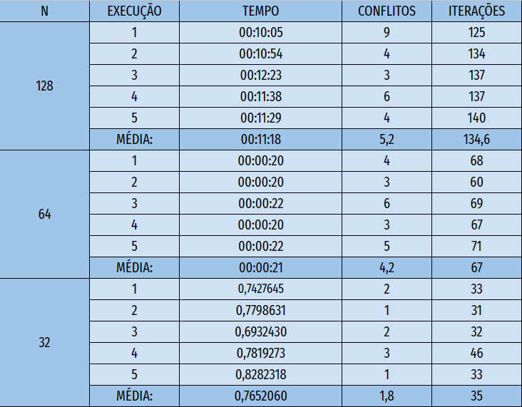

# Problema das N-Rainhas

O Problema das N-Rainhas é um problema clássico de colocação de peças em um tabuleiro de xadrez. O objetivo é posicionar N rainhas em um tabuleiro NxN, de tal forma que nenhuma rainha possa atacar outra. Isso significa que nenhuma rainha pode estar na mesma coluna, linha ou diagonal de outra rainha.

Este problema é um exemplo de um problema de busca de solução, onde o objetivo é encontrar uma solução que satisfaça certas restrições. Existem muitos algoritmos para resolver o problema das N-Rainhas, incluindo algoritmos de força bruta e algoritmos baseados em heurísticas.

O problema das N-Rainhas é importante em ciência da computação porque é um exemplo clássico de um problema de busca de solução e é utilizado como um benchmark para avaliar a eficácia dos algoritmos de busca de solução. Além disso, o problema possui aplicações em outras áreas, como inteligência artificial e criptografia.

# 1 - Hill-Climbing

O algoritmo começa com um estado inicial aleatório e itera até encontrar um estado onde não haja ataques entre as rainhas. Durante cada iteração, ele explora vizinhos que representam configurações diferentes das rainhas e escolhe o vizinho com o menor número de ataques. O código registra o estado final encontrado, o tempo de execução e o número de iterações realizadas. O histórico de ataques é utilizado para avaliar o desempenho do algoritmo. É importante notar que a solução pode variar de uma execução para outra devido à natureza estocástica do Hill Climbing.

## Execuções:

# 2 - Simulated Annealing

O algoritmo começa com um estado inicial aleatório, realiza movimentos aleatórios e aceita ou rejeita esses movimentos com base em uma probabilidade calculada em relação à temperatura atual. À medida que a temperatura diminui, a probabilidade de aceitar movimentos piores também diminui, permitindo ao algoritmo convergir para uma solução com menos ataques. O código mantém um histórico do número de ataques em cada iteração para análise. O Simulated Annealing é uma abordagem eficaz para encontrar soluções aproximadas para problemas de otimização combinatória.

## Execuções:

obs: A cada pico, é o inicio de uma nova execução, dando um total de 5 picos, ou seja, 5 execuções.

# 3 - Genético

O algoritmo cria uma população de indivíduos que são representados de forma binária, se N = 8, cada rainha do tabuleiro será representada por log de 8 na base 2, ou seja, 3 cromossomos. É uma abordagem eficaz para resolver o problema das N-Rainhas usando um algoritmo genético. Ele demonstra a aplicação de conceitos de seleção natural, cruzamento e mutação para encontrar soluções cada vez melhores ao longo das gerações. A implementação é flexível e pode ser adaptada para diferentes valores de N, tornando-se uma ferramenta útil para abordar esse desafiante problema de otimização combinatória.

Durante as execuções não observei mudanças significativas alterando a probabilidade de cruzamento ou de mutação de gerações futuras, e nem na geração inicial, o tamanho do torneio trás um pouco de mudanças em número menor, ou seja, sendo mais eletivo, mas observa-se uma mudança significativa quando se altera o tamanho da população, no entanto o tempo de execução aumenta exponencialmente.

## Execuções:

obs: resultados de uma das 5 execuções de cada N

# Conclusão:

É observado, que o Hill-Climbing dá resultados em um tempo mediano, encontrando soluções ótimas somente para pequenas quantidades de rainhas, e acaba ficando preso a mínimas locais. O Simulated Annealing, é uma versão otimizada do Hill-Climbing, que soluciona o problema de ficar preso em mínimos locais e tenta alcançar os mínimos globais, o qual faz com bastante excelência em grande parte das vezes, e em ótimos tempos, ou seja, ele entrega em um tempo ótimo, resultados ótimos em grande maioria das vezes. E por ultimo, temos o Genético, o qual vai ser necessário fazer alterações em suas variáveis para se conseguir chegar em um ótimo resultado, o algoritmo genético não traz resultados de forma rápida, ele leva um tempo consideravelmente longo para encontrar uma solução ótima, mas em teoria, é o melhor dentre os três para resolver o problema das N-Rainhas.